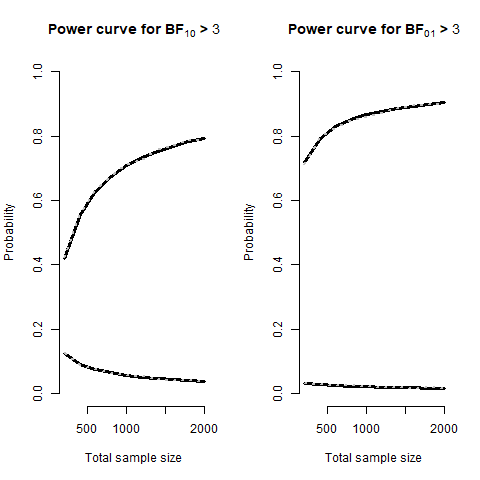
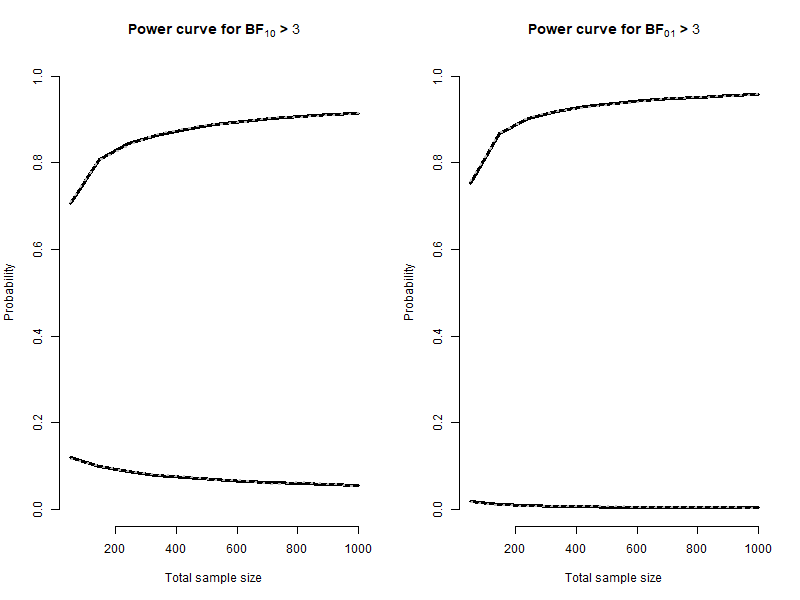
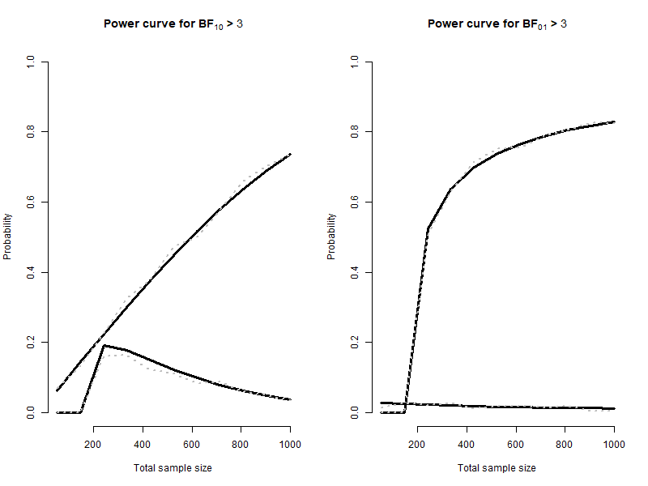
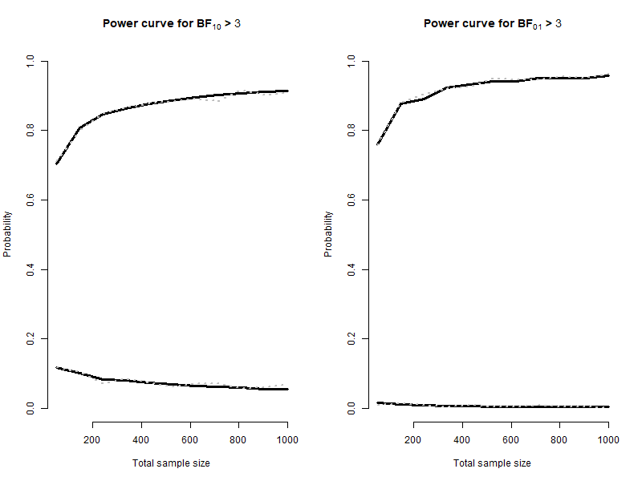
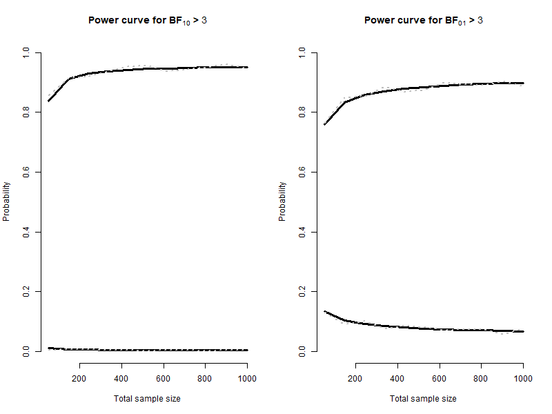

This folder contains the R scripts for running simulations used to verify our method.

## Method

The simulation process consists of three steps:

1. **Simulating cumulative probabilities**  
   A vector of cumulative probabilities of length *i* is generated. These probabilities are then transformed into effect sizes based on the design prior.

2. **Generating data**  
   For each simulated effect size, data are generated. For example, given a simulated delta, a corresponding *t*-value is drawn using the `rt` function.

3. **Computing the probabilities**  
   For a specified analysis prior, the probabilities that BF > *k* under the null hypothesis and alternative hypothesis are computed based on the simulations.

Simulations are conducted for sample sizes ranging from 100 to 1000 with increments of 100.

## Results

We ran simulations under various conditions, varying the design and analysis priors.  
The results show that the simulated probabilities of compelling and misleading evidence align closely with those obtained using our method. 

Users can replicate or extend these simulations using the scripts in this folder. Each script loads the required packages and defines custom functions for simulation. For each section of the script in`sim_figure.r` , users may adjust the input parameters as needed and run the simulation by executing the final lines of code toward the end of the section. 

Below, we show some of the simulation results using the specification of analysis and design priors from the Application section of the paper.  

- **Black solid lines** indicate the estimated results using our method.  
- **Gray dotted lines** show the simulated results.  
- **Top lines** correspond to true positive (left) / true negative (right) probabilities.  
- **Lower lines** correspond to false positive (left) / false negative (right) probabilities.

### t-test

```{r, echo=TRUE, eval=FALSE, message=FALSE, warning=FALSE, fig.width=8, fig.height=6}
# Example call to t_ver() (replace parameters with your actual values)
t_ver(iter = 10000,
      D = 3,
      model = "Normal",
      location = -0.23,
      scale = 0.2,
      dff = 1,
      hypothesis = "!=",
      model_d = "Normal",
      location_d = -0.23,
      scale_d = 0.2,
      dff_d = 1,
      de_an_prior = 0,
      r = 1,
      t1_T2 = FALSE,
      e = c(-0.36, 0.36))

```

```{r , echo=FALSE,  out.width = '50%'}

```

### Correlation
```{r , echo=TRUE, eval=FALSE, message=FALSE, warning=FALSE, fig.width=8, fig.height=6}
r_ver(iter=10000, D=3,model="beta",k=1, alpha=1, beta=1,
      h0=0,scale=1, hypothesis=">" ,model_d="Point",
      location_d=3,k_d=1, alpha_d=1, beta_d=1,scale_d=1,de_an_prior=1,e=NULL)


```

```{r , echo=FALSE,  out.width = '50%'}

```

### ANOVA
```{r , echo=TRUE, eval=FALSE, message=FALSE, warning=FALSE, fig.width=8, fig.height=6}
f_ver(iter=10000,D=3,p=3,k=4,dff=3,rscale=.18,f_m=.1,model="effectsize",
      dff_d=3,rscale_d=1,f_m_d=.1,model_d="Point",de_an_prior=0,e=NULL)

```

```{r , echo=FALSE,  out.width = '50%'}

```

### One proportion
```{r , echo=TRUE, eval=FALSE, message=FALSE, warning=FALSE, fig.width=8, fig.height=6}
bin_ver(iter=10000,h0=.5, D=3,model="beta",  alpha=1, beta=1,location=.5,
        scale=1, hypothesis=">" ,model_d="Point",
        location_d=.55,k_d=1, alpha_d=1, beta_d=1,scale_d=1,de_an_prior=1,e=NULL)
```

```{r , echo=FALSE,  out.width = '50%'}

```

### Two proportion

```{r , echo=TRUE, eval=FALSE, message=FALSE, warning=FALSE, fig.width=8, fig.height=6}
p2_ver(iter=10000,D=3, a0=1, b0=1, a1=156, b1=339, a2=151, b2=339,
       model1="same",da1=156,db1=339,dp1=.5,model2="same",da2=151,db2=339,dp2=.5)


```

```{r , echo=FALSE,  out.width = '50%'}

```
